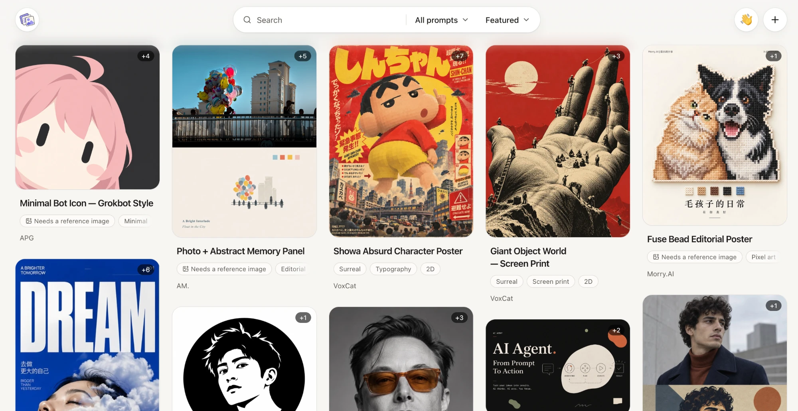

  

<h1 align="center">Image Prompt Book</h1>

<strong>Explore image prompts. Make them yours.</strong>

  An open-source gallery of image generation prompts. Start from a real example you like, adjust the highlighted options right inside the prompt, then copy it or open it in ChatGPT.

  <a href="https://imagepromptbook.com">Website</a> ·
  <strong>English</strong> | <a href="./README.zh-CN.md">简体中文</a>

  

This is a personal, curated collection. Every prompt is picked purely by my own taste, and only the ones I think are genuinely good go live — so a suggestion may not be added, and that's no judgment of your work.

## Submit a prompt

Every contribution is a GitHub issue — no code, no Git. We don't accept pull requests: maintainers make every change, so rights and quality are reviewed in one place.

### Suggest a prompt

1. Open a **[“Suggest a prompt source” issue](https://github.com/thinkingjimmy/Image-Prompt-Book/issues/new?template=source-lead.yml)**.
2. Paste the link to the prompt — the exact post, page or file.
3. Describe what it makes and what input it needs (for example, “turns a character photo into a minimal bot icon; needs one reference image”).
4. Add the author's public profile if you know it. If you don't, leave it empty — please don't guess.
5. Mention the license or usage terms if the source states them.

A maintainer checks the license, writes the English and Chinese versions, picks the options that are worth adjusting and adds example images with their rights recorded. We'll reply in your issue and link it when the prompt goes live.

### Other ways to help

- **Better wording** — open a [translation issue](https://github.com/thinkingjimmy/Image-Prompt-Book/issues/new?template=translation.yml).
- **Something broken or missing** — [report a problem](https://github.com/thinkingjimmy/Image-Prompt-Book/issues/new?template=problem.yml).
- **Your work is here and shouldn't be** — open a [rights request](https://github.com/thinkingjimmy/Image-Prompt-Book/issues/new?template=rights-request.yml). You never need to post identity documents publicly.

### What we accept

- Prompts whose license allows sharing, with a clear author and source.
- The original imported word for word; translations are complete sentences, never shortened summaries.
- Real example images that you have the right to share — no placeholders presented as results, no hot-linked images.
- No invented authors, links, licenses, models or “verified” claims. Unknown stays unknown.

## Acknowledgements

Each prompt is credited to the person we believe created it. See [docs/ACKNOWLEDGEMENTS.md](./docs/ACKNOWLEDGEMENTS.md) for who made each one.

## Sources and takedowns

Prompts are hard to trace back to whoever first wrote them. Most entries here come from GitHub and X (Twitter), and every page names and links its source. Every request below goes through a GitHub issue.

1. **Credited to the wrong person** — if we credited someone who reposted a prompt rather than created it, open a [rights request](https://github.com/thinkingjimmy/Image-Prompt-Book/issues/new?template=rights-request.yml) with evidence, such as a link to the earlier original post.
2. **Default terms** — unless the source says otherwise, we treat a publicly shared prompt as fine to share with credit. If you'd rather not be included, open a [rights request](https://github.com/thinkingjimmy/Image-Prompt-Book/issues/new?template=rights-request.yml) and we'll remove it. If you'd like your prompt included, [suggest it](https://github.com/thinkingjimmy/Image-Prompt-Book/issues/new?template=source-lead.yml).
3. **Images and real people** — AI image results can be unpredictable and may resemble real people or existing works. If you hold the rights to something shown here, including your own likeness, open a [rights request](https://github.com/thinkingjimmy/Image-Prompt-Book/issues/new?template=rights-request.yml) and we'll take it down.

## Security

Report vulnerabilities **privately** through [GitHub Security Advisories](https://github.com/thinkingjimmy/Image-Prompt-Book/security/advisories/new) — please don't open a public issue. Include the affected URL or file, steps to reproduce and the impact. We aim to reply within 7 days.

Concerns about rights or privacy of content aren't security issues; use the [rights request](https://github.com/thinkingjimmy/Image-Prompt-Book/issues/new?template=rights-request.yml) instead.

## License

The [MIT License](./LICENSE) covers the **website source code only** — the app, scripts, tests (except fixture data), configuration and the project's own documentation.

It does **not** cover the content the site shows:

| Material | Where | License |
| --- | --- | --- |
| Third-party prompts (original text) | `content/prompts/*/original.*.txt` | The author's license, recorded in each entry's `meta.json` and `ATTRIBUTION.md` |
| Translations and adjustable versions of those prompts | `content/prompts/*/` templates, options and page copy, `docs/appendix/` | Same license as the original, marked as adapted |
| Example images | `content/prompts/*/images/` | Recorded per image in `examples.json`; never implied by the prompt's license |

Nothing here is offered for unconditional commercial use unless its own record says so. By suggesting content you confirm you have the right to share it, or that its license allows sharing.
